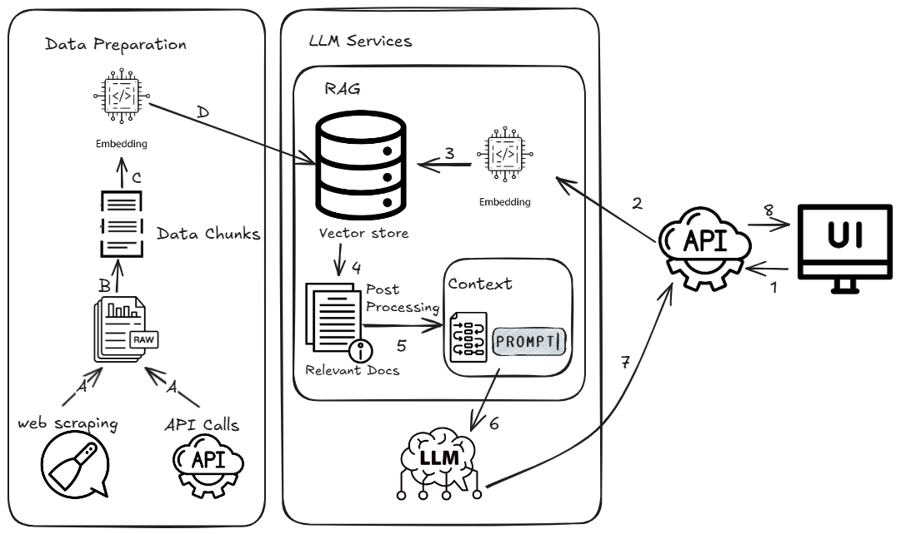
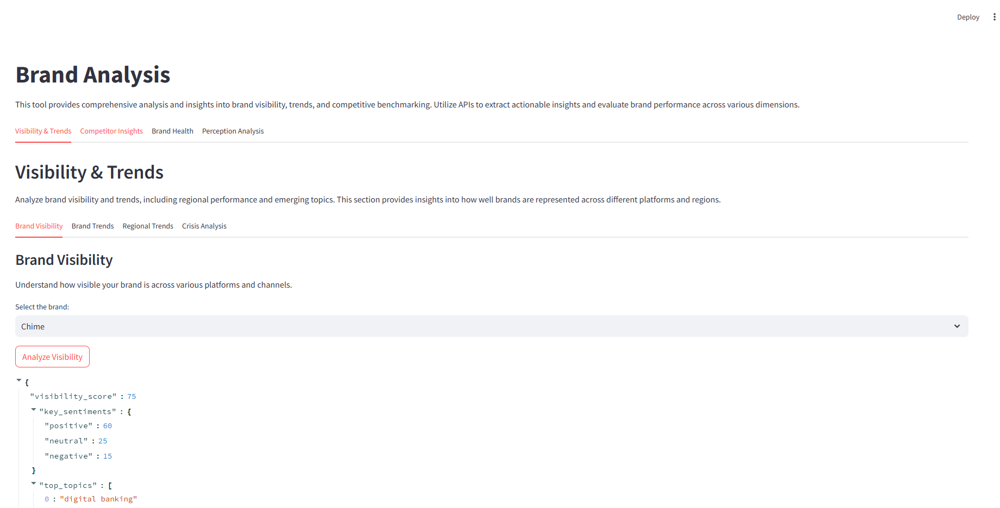

# Brand Analysis API



## Table of Contents
1. [Overview](#overview)
2. [File Structure](#file-structure)
   - [Root Directory](#root-directory)
   - [Backend Directory](#backend-directory)
   - [Frontend Directory](#frontend-directory)
3. [Installation and Setup](#installation-and-setup)
   - [Prerequisites](#prerequisites)
   - [Steps](#steps)
4. [Running Tests](#running-tests)
5. [API Endpoints](#api-endpoints)
   - [Brand Visibility](#1-brand-visibility)
   - [Brand Comparison](#2-brand-comparison)
   - [Brand Trends](#3-brand-trends)
   - [Emerging Competitors](#4-emerging-competitors)
   - [Crisis Analysis](#5-crisis-analysis)
   - [Audience Segmentation](#6-audience-segmentation)
   - [Competitive Benchmarking](#7-competitive-benchmarking)
   - [Brand Health Score](#8-brand-health-score)
   - [Regional Trends](#9-regional-trends)
   - [Self-Representation](#10-self-representation)
   - [GPT Perception](#11-gpt-perception)
   - [Self vs GPT Comparison](#12-self-vs-gpt-comparison)
   - [Brand Self Representation Ranking](#13-brand-self-representation-ranking)
   - [Multi-Ranking by Areas](#14-multi-ranking-by-areas)
6. [Contribution](#contribution)
7. [License](#license)

---
## Overview

The Brand Analysis API provides a set of endpoints for analyzing brand performance, visibility, audience segmentation, competitive benchmarking, and more. This application leverages LLMs and GPT-based chains to generate actionable insights about brands.


---

## File Structure

### Root Directory
- **docker-compose.yml**: Configuration for Docker services.
- **.env**: Environment variables for the application.

### Backend Directory
- **app.py**: The main FastAPI application with defined endpoints.
- **config.ppy**: Configuration for GPT, Logging, etc.
- **Dockerfile**: Dockerfile for building the backend service.
- **requirements.txt**: Python dependencies for the backend.
- **data/**: Contains scraped data for different brands.
- **models/**: Contains input and output models for API requests and responses.
- **prompt_templates/**: YAML files for GPT chain templates.
- **utils/**: Utility functions and classes.

### frontend Directory
- **streamlit_app.py**: The main FastAPI application with defined endpoints.
- **config.ppy**: Configuration for Logging, etc.
- **Dockerfile**: Dockerfile for building the frontend service.
---

## Installation and Setup

### Prerequisites
- Python 3.11
- Docker
- Docker Compose

### Steps
1. Clone the repository.
```sh
git clone <repository-url>
```
2. Navigate to the project directory.
```sh
cd <repository-directory>/<project-directory>
```
3. Create a `.env` file with necessary environment variables (e.g., API keys, database credentials).
```bash
# OpenAI API Configuration
OPENAI_API_KEY=your-openai-api-key  # Replace with your actual OpenAI API key
OPENAI_MODEL=gpt-4o  # Default model name
OPENAI_TIMEOUT=30  # Timeout in seconds
OPENAI_TEMPERATURE=0.3  # Model temperature for response variability

#Ports Configurations
BACKEND_PORT=8000
FRONTEND_PORT=8501

```
4. Build and run the application using Docker Compose:
   ```bash
   docker-compose up --build
   ```
5. Access the FastAPI backend at `http://localhost:<backend_port>/docs`.
6. Access the UI frontend at `http://localhost:<frontend_port>`.
---

### Running Tests
1. Make sure you have `Poetry` innstalled in your enviornment
```sh
pip install poetry
```
2. Navigate to the tests directory 
``` sh
cd backend/tests
```
3. Install dependencies
```sh
poetry shell
poetry install
```
4. Run the tests
```sh
 pytest
```
## API Endpoints

### Base URL
`http://localhost:<backend_port>`

### Endpoints

## **1. Brand Visibility**
### Description
Analyzes a brand's visibility and sentiment across digital platforms.

### Endpoint
`POST /brand/visibility`

### Input Example
```json
{
  "brand_name": "Chime"
}
```

### Output Example
```json
{
  "visibility_score": 85,
  "key_sentiments": {
    "positive": 50,
    "neutral": 30,
    "negative": 20
  },
  "top_topics": ["Savings Accounts", "Mobile Banking", "Customer Support"],
  "top_regions": ["North America", "Europe", "Asia"]
}
```

---

## **2. Brand Comparison**
### Description
Compares two brands based on visibility, sentiment, and differentiators.

### Endpoint
`POST /brand/comparison`

### Input Example
```json
{
  "brand1": "Chime",
  "brand2": "Ally"
}
```

### Output Example
```json
{
  "brand1_visibility": 85,
  "brand2_visibility": 80,
  "differentiators": ["Better Customer Support", "Advanced Mobile App"]
}
```

---

## **3. Brand Trends**
### Description
Provides trending topics and regions for a brand over a specific time period.

### Endpoint
`POST /brand/trends`

### Input Example
```json
{
  "brand_name": "Chime",
  "time_period": "Last 3 months"
}
```

### Output Example
```json
{
  "trending_topics": [
    {"topic": "Savings Accounts", "sentiment_score": 90},
    {"topic": "Customer Support", "sentiment_score": 85}
  ],
  "emerging_regions": ["North America", "Europe"]
}
```

---

## **4. Emerging Competitors**
### Description
Identifies emerging competitors for a brand within an industry.

### Endpoint
`POST /brand/emerging_competitors`

### Input Example
```json
{
  "brand_name": "Chime",
  "industry": "Digital Banking"
}
```

### Output Example
```json
{
  "brand_name": "Chime",
  "competitors": [
    {
      "name": "SoFi",
      "growth_rate": 12.5,
      "differentiators": ["Low Fees", "Unique Offers"]
    }
  ]
}
```

---

## **5. Crisis Analysis**
### Description
Analyzes negative trends affecting a brand.

### Endpoint
`POST /brand/crisis_analysis`

### Input Example
```json
{
  "brand_name": "Chime",
  "time_period": "Last 3 months"
}
```

### Output Example
```json
{
  "brand_name": "Chime",
  "negative_trends": ["Technical Glitches", "Customer Complaints"],
  "root_causes": ["System Downtime", "Staffing Issues"],
  "recommendations": ["Improve IT Infrastructure", "Enhance Training Programs"]
}
```

---

## **6. Audience Segmentation**
### Description
Provides insights into audience demographics and behavior.

### Endpoint
`POST /brand/audience_segmentation`

### Input Example
```json
{
  "brand_name": "Chime",
  "time_period": "Last 6 months"
}
```

### Output Example
```json
{
  "brand_name": "Chime",
  "key_segments": [
    {
      "demographics": {"age": "18-35", "gender": "Male", "location": "urban areas"},
      "preferences": ["Mobile Banking", "Low Fees"],
      "engagement_patterns": {"social_media": 70, "reviews": 30}
    }
  ]
}
```

---

## **7. Competitive Benchmarking**
### Description
Benchmarks a brand against competitors.

### Endpoint
`POST /brand/competitive_benchmarking`

### Input Example
```json
{
  "brand_name": "Chime",
  "competitors": ["Ally", "VaroMoney"],
  "time_period": "Last 12 months"
}
```

### Output Example
```json
{
    "visibility_scores": {
        "Chime": 85, "Ally": 90, "VaroMoney": 75
    },
    "sentiment_distributions": {
        "Chime": {"positive": 60, "neutral": 30, "negative": 10},
        "Ally": {"positive": 55, "neutral": 35, "negative": 10},
        "VaroMoney": {"positive": 50, "neutral": 40, "negative": 10}
    },
    "key_differentiators": {
        "Chime": ["No monthly fees", "Early direct deposit", "Automatic savings"],
        "Ally": ["High-interest savings", "Wide range of financial products", "24/7 customer service"],
        "VaroMoney": ["No credit check for account opening", "Cashback rewards", "Varo Advance"]
    }
}
```

---

## **8. Brand Health Score**
### Description
Calculates the health score for a brand.

### Endpoint
`POST /brand/health_score`

### Input Example
```json
{
  "brand_name": "Chime"
}
```

### Output Example
```json
{
  "brand_name": "Chime",
  "health_score": 90,
  "industry_benchmark": 85,
  "key_insights": ["Strong User Base", "Good Reputation"],
  "improvement_areas": ["Better Offers", "More Features"]
}
```

---

## **9. Regional Trends**
### Description
Analyzes regional trends for a brand.

### Endpoint
`POST /brand/regional_trends`

### Input Example
```json
{
  "brand_name": "Chime",
  "region": "North America",
  "time_period": "Last 3 months"
}
```

### Output Example
```json
{
  "key_trends": [{
    "trend":"Financial Education",
    "description":"Rising importance of financial literacy programs as consumers look to improve their financial knowledge."
    }],
  "recommendations": ["Focus on Youth Demographics"]
}
```

---

## **10. Self-Representation**
### Description
Analyzes how a brand represents itself across selected topics.

### Endpoint
`POST /brand/self_representation`

### Input Example
```json
{
  "brand_name": "Chime",
  "topics": ["Customer Support", "Innovation"]
}
```

### Output Example
```json
{
  "brand_name": "Chime",
  "self_representation_score": 80,
  "insights": ["Strong on Customer Support"]
}
```

---

## **11. GPT Perception**
### Description
Analyzes GPT's perception of a brand based on topics.

### Endpoint
`POST /brand/gpt_perception`

### Input Example
```json
{
  "brand_name": "Chime",
  "topics": ["Customer Support", "Innovation"]
}
```

### Output Example
```json
{
  "brand_name": "Chime",
  "gpt_perception_score": 75,
  "insights": ["Positive on Support"]
}
```

---

## **12. Self vs GPT Comparison**
### Description
Compares a brand's self-representation with GPT's perception.

### Endpoint
`POST /brand/self_vs_gpt`

### Input Example
```json
{
  "brand_name": "Ally",
  "topics": ["Interest Rates", "Credit Card Rewards"],
}
```

### Output Example
```json
{
    "self_representation_score": 75,
    "gpt_perception_score": 70,
    "alignment_score": 80,
    "discrepancies": [
        "Ally focuses on providing detailed information about interest rate management strategies, particularly in investment and mortgage contexts, while GPT perceives Ally primarily as a provider of competitive rates without specific strategies.",
        "Ally's credit card rewards are not prominently featured in the retrieved documents, leading to a gap in perception where GPT might assume less emphasis on rewards compared to other financial services."
    ]
}
```

---

## **13. Brand Self Representation Ranking**
### Description
Ranks brands by self-representation across topics.

### Endpoint
`POST /brand/self_representation_ranking`

### Input Example
```json
{
  "brands": ["Chime", "Ally"],
  "topics": ["Innovation"]
}
```

### Output Example
```json
{
  "ranked_brands": [
    {"brand_name": "Chime", "score": 85, "insights": ["..."]},
    {"brand_name": "Ally", "score": 80, "insights": ["..."]}
  ],
}
```

---

## **14. Multi-Ranking by Topics**
### Description
Ranks brands across multiple areas and calculates overall rankings.

### Endpoint
`POST /brand/rankings`

### Input Example
```json
{
  "brands": ["Chime", "Ally"],
  "areas": ["Customer Service", "Investment Services"]
}
```

### Output Example
```json
{
    "rankings": [
        {
            "topic": "Customer Service",
            "rankings": [{"Ally": 85},{"Chime": 90}]
        },
        {
            "topic": "Investment Services",
            "rankings": [{"Ally": 90}, {"Chime": 75}]
        }
    ],
    "overall_ranking": [{"Ally": 88}, {"Chime": 83}]
}
```

---

## Contribution
1. Fork the repository.
2. Create a feature branch.
3. Commit your changes.
4. Submit a pull request.

---

## License
This project is licensed under the MIT License. See `LICENSE` for details.
